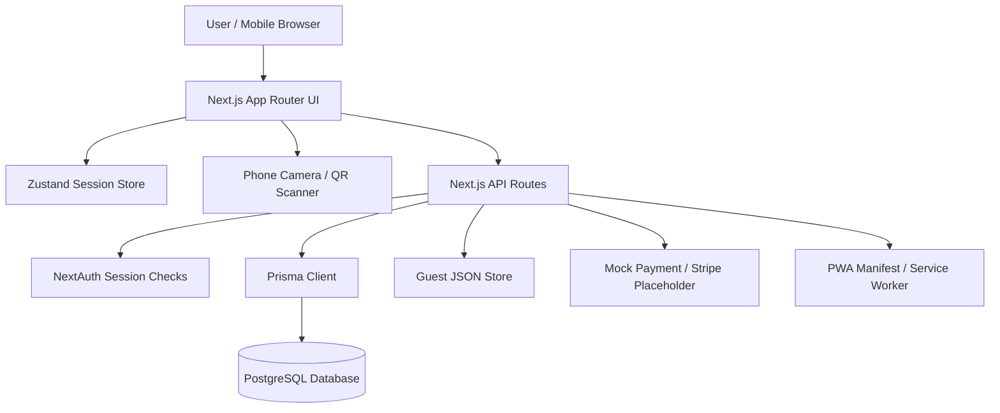

# Carto Smart Shopping Cart System — Technical Project Report

## 1. Cover Page

**Project name:** Carto

**Subtitle:** Smart Shopping Cart System

**Short description:** Carto is a smart shopping cart web application that lets users create shopping lists, connect a selected list to a physical cart through QR scanning, monitor an active shopping session, view a virtual receipt, and complete a demo checkout flow.

**Technologies summary:** Next.js 14 App Router, React 18, TypeScript, Tailwind CSS, Prisma, PostgreSQL, NextAuth.js, Zustand, Zod, QR scanning/generation libraries, PWA support, and mock/placeholder payment integration.

**Date generated:** April 29, 2026

**Author/team:** Not found in the codebase.

**Primary evidence:** `package.json`, `prisma/schema.prisma`, `app/`, `components/`, `lib/`, `store/`, `README.md`, and `SETUP.md`.

## 2. Executive Summary

Carto is a full-stack smart shopping cart system implemented as a Next.js application. It combines a shopper-facing web interface with backend API routes, authentication, database models, QR/cart linking, active shopping sessions, and receipt/checkout flows.

The project solves a practical retail workflow problem: a shopper can prepare a grocery list before shopping, link that list to a smart cart at the store, track progress as items are collected or scanned, and review a virtual receipt before checkout. The target users are shoppers, developers/evaluators reviewing the system, and potentially store operators if the platform is extended.

The main value of the application is workflow integration: list planning, cart activation, receipt tracking, and checkout are connected in one interface. The app also includes guest mode, making it suitable for demonstrations without full account setup.

Based on the codebase, this appears to be an academic prototype or MVP rather than a production-ready commercial system. Evidence: the project is versioned as `0.1.0` and private in `package.json`; `README.md` states it is created for academic purposes; the payment route uses mock payment behavior with live Stripe code only sketched as comments in `app/api/payment/create/route.ts`; guest mode persists data through `guest_data.json` via `store/guest-store.ts`.

## 3. Project Overview

### Main Idea

Carto models a smart shopping experience. A user creates a shopping list, activates it, links it to a physical cart, follows progress during shopping, and completes checkout from a virtual receipt.

### User Journey

1. The user opens the app and signs in, signs up, or continues as guest.
2. The user opens the dashboard and creates or selects a shopping list.
3. The user adds items manually or through product search.
4. The user activates the list and opens the cart linking page.
5. The user scans a cart QR code or enters cart ID and pairing code manually.
6. The backend creates an active cart session and a draft receipt.
7. The user monitors remaining items, collected items, cart status, and receipt totals.
8. The user finishes shopping, locks the receipt, and opens checkout.
9. The user completes the demo payment and can later view the receipt in history.

### Smart Cart Concept

The smart cart is represented by the `Cart` model in `prisma/schema.prisma`. It includes a public `cartCode`, optional Bluetooth/pairing metadata, a `storeId`, status, and last-seen timestamp. Cart linking logic is implemented in `app/api/cart/link/route.ts`.

### Shopping List Concept

Shopping lists are represented by `ShoppingList` and `ListItem` models. The list interface is implemented through `app/lists/page.tsx`, `app/lists/new/page.tsx`, `app/lists/[id]/page.tsx`, and `components/lists/ListItemsManager.tsx`.

### QR Cart Linking Concept

The camera scanner is implemented in `components/carto/QrScanner.tsx` using `@zxing/browser`. The session start page parses and validates cart QR payloads in `app/session/start/page.tsx`. The backend endpoint `app/api/cart/link/route.ts` validates ownership, cart availability, pairing code, and creates the session/receipt.

### Active Shopping Session Concept

The `CartSession` model connects a user, list, cart, and receipt. The active session screen in `app/session/page.tsx` polls session APIs and uses `store/session-store.ts` for shared client state.

### Virtual Receipt Concept

Receipts are represented by `Receipt` and `ReceiptItem`. The live receipt panel is implemented in `components/receipt/VirtualReceipt.tsx`. Receipt APIs live under `app/api/receipts/[id]`.

### Checkout Concept

Checkout starts after a session is finished through `app/api/sessions/[id]/finish/route.ts`. The checkout page is `app/checkout/page.tsx`; payment processing is handled by `app/api/payment/create/route.ts`. The current implementation is mock/demo payment, with Stripe libraries present but live Stripe processing not fully implemented.

## 4. Key Features

### User authentication

**What it does:** Supports sign up, sign in, JWT sessions, and protected server/API access.

**How the user interacts with it:** Users create an account or sign in through `/auth/signup` and `/auth/signin`.

**Related pages/components:** `app/auth/signup/page.tsx`, `app/auth/signin/page.tsx`

**Related API routes:** `app/api/auth/signup/route.ts`, `app/api/auth/[...nextauth]/route.ts`

**Related database models:** `User`

### Guest mode

**What it does:** Allows demo use without a full authenticated account by setting guest cookies and storing guest lists.

**How the user interacts with it:** Users press "Continue as Guest" from auth screens.

**Related pages/components:** `app/auth/signin/page.tsx`, `app/auth/signup/page.tsx`

**Related API routes:** `app/api/auth/guest-bypass/route.ts`, `store/guest-store.ts`

**Related database models:** Guest mode uses JSON-backed local storage; database model not used for unauthenticated guest lists.

### Dashboard

**What it does:** Shows summary metrics, recent lists, and quick actions for starting shopping.

**How the user interacts with it:** After login/guest entry, users land on `/dashboard`.

**Related pages/components:** `app/dashboard/page.tsx`, `components/ui/MetricCard.tsx`, `components/ui/ProgressBar.tsx`

**Related API routes:** Server component queries Prisma directly; no dedicated dashboard API found.

**Related database models:** `ShoppingList`, `Receipt`, `ReceiptItem`

### Shopping list CRUD

**What it does:** Creates, displays, updates, and deletes shopping lists.

**How the user interacts with it:** Users browse `/lists`, create via `/lists/new`, open `/lists/:id`, and delete lists.

**Related pages/components:** `app/lists/page.tsx`, `app/lists/new/page.tsx`, `app/lists/[id]/page.tsx`, `components/lists/ListCards.tsx`

**Related API routes:** `app/api/lists/route.ts`, `app/api/lists/[id]/route.ts`

**Related database models:** `ShoppingList`, `ListItem`

### Shopping list items

**What it does:** Adds, updates, toggles, and deletes list items with immediate UI feedback.

**How the user interacts with it:** Users quick-add items, search products, adjust quantities, mark collected, and delete.

**Related pages/components:** `components/lists/ListItemsManager.tsx`, `components/lists/ProductSearch.tsx`

**Related API routes:** `app/api/lists/[id]/items/route.ts`, `app/api/lists/[id]/items/[itemId]/route.ts`

**Related database models:** `ListItem`, `ShoppingList`, `Product`

### Product search

**What it does:** Searches database products or local fallback dataset and returns popular/search results.

**How the user interacts with it:** Users open product search from the list detail screen.

**Related pages/components:** `components/lists/ProductSearch.tsx`, `lib/product-dataset.ts`

**Related API routes:** `app/api/products/route.ts`

**Related database models:** `Product`

### QR code and cart linking

**What it does:** Scans cart QR payloads, validates cart identifiers/pairing codes, creates dynamic carts if needed, and starts sessions.

**How the user interacts with it:** Users choose a list, open `/session/start`, scan a cart QR, or enter cart details manually.

**Related pages/components:** `app/session/start/page.tsx`, `components/carto/QrScanner.tsx`

**Related API routes:** `app/api/cart/link/route.ts`, `app/api/cart/qrcode/route.ts`, `app/api/carts/[cartCode]/route.ts`

**Related database models:** `Cart`, `Store`, `CartSession`, `Receipt`, `Notification`

### Active shopping sessions

**What it does:** Displays linked cart state, remaining/collected items, progress, and current receipt total.

**How the user interacts with it:** Users view `/session` after cart linking or from quick actions.

**Related pages/components:** `app/session/page.tsx`, `store/session-store.ts`

**Related API routes:** `app/api/sessions/active/route.ts`, `app/api/sessions/[id]/route.ts`, `app/api/sessions/[id]/finish/route.ts`

**Related database models:** `CartSession`, `ShoppingList`, `ListItem`, `Receipt`

### Virtual receipt

**What it does:** Shows scanned items, subtotal, tax, total, and receipt status.

**How the user interacts with it:** Users see the receipt panel during an active session and at checkout.

**Related pages/components:** `components/receipt/VirtualReceipt.tsx`, `components/ui/ReceiptPanel.tsx`

**Related API routes:** `app/api/receipts/[id]/route.ts`, `app/api/receipts/[id]/items/route.ts`, `app/api/receipts/[id]/items/[itemId]/route.ts`

**Related database models:** `Receipt`, `ReceiptItem`

### Receipt item scanning simulation

**What it does:** Adds items to a receipt through an API to simulate cart scanning.

**How the user interacts with it:** Developer/tester can POST scanned items to the receipt items endpoint.

**Related pages/components:** No dedicated UI found for manual receipt item simulation.

**Related API routes:** `app/api/receipts/[id]/items/route.ts`

**Related database models:** `Receipt`, `ReceiptItem`

### Checkout and payment

**What it does:** Locks a receipt, displays checkout summary, processes mock payment, updates status and history.

**How the user interacts with it:** Users finish shopping, review `/checkout`, then confirm payment.

**Related pages/components:** `app/checkout/page.tsx`, `app/checkout/success/page.tsx`

**Related API routes:** `app/api/payment/create/route.ts`, `app/api/sessions/[id]/finish/route.ts`

**Related database models:** `Receipt`, `CartSession`, `Cart`, `UserStats`, `UserFavoriteProduct`, `Notification`

### Order/history pages

**What it does:** Shows paid receipt history.

**How the user interacts with it:** Users open `/history` from navigation.

**Related pages/components:** `app/history/page.tsx`, `components/layout/BottomNav.tsx`

**Related API routes:** Server component queries Prisma directly; no dedicated history API found.

**Related database models:** `Receipt`, `ReceiptItem`, `Store`

### Notifications

**What it does:** Lists notifications, counts unread items, and marks selected notifications read.

**How the user interacts with it:** No complete notification UI found in the inspected pages; API support exists.

**Related pages/components:** Not found as a full user-facing notifications page.

**Related API routes:** `app/api/notifications/route.ts`

**Related database models:** `Notification`

### Wishlist and favorites

**What it does:** Provides APIs for wishlist items and favorite product tracking.

**How the user interacts with it:** No complete wishlist/favorites page found in inspected page routes; API support exists.

**Related pages/components:** Not found as a full user-facing wishlist/favorites page.

**Related API routes:** `app/api/wishlist/route.ts`, `app/api/wishlist/[itemId]/route.ts`, `app/api/users/favorites/route.ts`

**Related database models:** `Wishlist`, `WishlistItem`, `UserFavoriteProduct`, `Product`

### Stores and carts

**What it does:** Represents physical carts, stores, cart status, and dynamic cart lookup/linking.

**How the user interacts with it:** Cart data is mostly used behind the cart linking flow.

**Related pages/components:** `app/session/start/page.tsx`

**Related API routes:** `app/api/stores/route.ts`, `app/api/carts/[cartCode]/route.ts`, `app/api/cart/link/route.ts`

**Related database models:** `Store`, `Cart`

### PWA/mobile support

**What it does:** Includes manifest, icons, service worker config, and iPhone HTTPS camera guidance.

**How the user interacts with it:** Users can run mobile testing through HTTPS/tunnel scripts and use phone camera scanning.

**Related pages/components:** `app/layout.tsx`, `SETUP.md`, `README.md`

**Related API routes:** No API specific to PWA installability.

**Related database models:** No database model.

## 5. Technology Stack

| Technology | Category | Where Used | Purpose | Evidence |
| --- | --- | --- | --- | --- |
| Next.js | Full-stack framework | App Router pages and API routes | Routing, SSR/server components, API endpoints | `package.json`, `app/*`, `app/api/*` |
| React | Frontend UI | Client components and interactive screens | UI rendering and component state | `package.json`, `components/*`, `app/*/page.tsx` |
| TypeScript | Language/tooling | Application source and types | Static typing | `tsconfig.json`, `types/index.ts` |
| Tailwind CSS | Styling | Global CSS and utility classes | Responsive UI styling | `tailwind.config.ts`, `app/globals.css`, component class names |
| Prisma | ORM/data access | Prisma client and schema | PostgreSQL database access | `prisma/schema.prisma`, `lib/prisma.ts` |
| PostgreSQL | Database | Prisma datasource provider | Relational persistence | `prisma/schema.prisma` datasource provider |
| NextAuth.js | Authentication | Credentials auth and session checks | JWT sessions and protected data access | `lib/auth-config.ts`, `app/api/auth/[...nextauth]/route.ts` |
| Zustand | Client state | Active session store | Shared session and receipt state | `store/session-store.ts` |
| Zod | Validation | API and form schemas | Runtime validation | `lib/validations.ts` |
| @zxing/browser | QR scanning | Camera QR scanner | Decode cart QR codes from video | `components/carto/QrScanner.tsx`, `package.json` |
| qrcode / qrcode.react | QR generation | QR code API and UI support | Generate QR payloads/data URLs | `app/api/cart/qrcode/route.ts`, `package.json` |
| Stripe libraries | Payments | Dependency and placeholder logic | Future payment integration; current flow is mock/demo | `package.json`, `app/api/payment/create/route.ts` |
| next-pwa | PWA/service worker | PWA config and generated service worker | Installability/offline caching support | `next.config.js`, `public/manifest.json`, `public/sw.js` |
| bcryptjs | Security | Password hashing and verification | Hash passwords and verify credentials | `lib/auth.ts`, `app/api/auth/signup/route.ts` |
| date-fns | Date formatting | List recency display | Human-readable date distances | `app/lists/page.tsx`, `package.json` |
| clsx / tailwind-merge | UI utilities | Class name composition | Conditional Tailwind classes | `lib/utils.ts`, component files |
| ESLint | Code quality | Next lint script | Static lint checks | `.eslintrc.json`, `package.json` |

### Dependency Evidence From `package.json`

Runtime dependencies:

- @prisma/client: ^5.19.0
- @stripe/stripe-js: ^2.4.0
- @tailwindcss/forms: ^0.5.11
- @zxing/browser: ^0.1.5
- bcryptjs: ^2.4.3
- clsx: ^2.1.1
- date-fns: ^3.6.0
- dotenv: ^17.2.3
- next: ^14.2.0
- next-auth: ^4.24.7
- next-pwa: ^5.6.0
- qrcode: ^1.5.3
- qrcode.react: ^3.1.0
- react: ^18.3.0
- react-dom: ^18.3.0
- stripe: ^14.21.0
- tailwind-merge: ^2.4.0
- zod: ^3.23.8
- zustand: ^4.5.2

Development dependencies:

- @types/bcryptjs: ^2.4.6
- @types/node: ^20.14.0
- @types/qrcode: ^1.5.5
- @types/react: ^18.3.0
- @types/react-dom: ^18.3.0
- autoprefixer: ^10.4.19
- eslint: ^8.57.0
- eslint-config-next: ^14.2.0
- postcss: ^8.4.38
- prisma: ^5.19.0
- tailwindcss: ^3.4.4
- ts-node: ^10.9.2
- typescript: ^5.5.0

## 6. System Architecture

Carto is a modular monolith built with Next.js App Router. The frontend pages, reusable React components, API routes, authentication logic, and database access live in the same project. API routes are serverless-style route handlers under `app/api`, while persistent data is accessed through Prisma and PostgreSQL.

The frontend/backend relationship is direct: client components call Next.js API routes with `fetch`, and server components query Prisma directly after checking session or guest mode. Authentication is handled through NextAuth.js; protected API routes call `getServerSession(authOptions)`.

### Architecture Characteristics

- **Application style:** Full-stack Next.js modular monolith.
- **Frontend:** React components and App Router pages under `app/` and `components/`.
- **Backend:** Next.js route handlers under `app/api/`.
- **Database layer:** Prisma client in `lib/prisma.ts`.
- **Authentication:** NextAuth config in `lib/auth-config.ts` and provider wrapper in `app/providers.tsx`.
- **Client state:** Zustand store in `store/session-store.ts`.
- **Validation:** Zod schemas in `lib/validations.ts`.
- **Guest storage:** Local JSON-backed store in `store/guest-store.ts`.

### Architecture Diagram

### Data Flow Example: Cart Linking

1. User selects a list and opens `/session/start?listId=...`.
2. `components/carto/QrScanner.tsx` captures a QR payload.
3. `app/session/start/page.tsx` validates the QR JSON through Zod schemas.
4. The UI posts cart data to `POST /api/cart/link`.
5. `app/api/cart/link/route.ts` verifies the user session and list ownership.
6. The route creates or updates `Cart`, creates `CartSession`, creates a draft `Receipt`, and creates a `Notification`.
7. The user is routed to `/session?sessionId=...`.

## 7. Project Structure

Important directories:

- `app/`: App Router pages, layouts, API routes, global styles, and providers.
- `components/`: Reusable UI, layout, list, cart, and receipt components.
- `lib/`: Auth helpers, Prisma client, validations, hooks, utility functions, and product dataset.
- `store/`: Zustand active session store and guest data store.
- `prisma/`: Database schema, migrations, and seed script.
- `public/`: Images, icons, manifest, and generated service worker assets.
- `types/`: Shared TypeScript interfaces and NextAuth type augmentation.

### Page Routes Found

- `/`
- `/auth/signin`
- `/auth/signup`
- `/checkout`
- `/checkout/success`
- `/dashboard`
- `/history`
- `/lists`
- `/lists/:id`
- `/lists/new`
- `/profile`
- `/session`
- `/session/start`

### API Routes Found

- `/api/auth/:...nextauth`
- `/api/auth/guest`
- `/api/auth/guest-bypass`
- `/api/auth/signup`
- `/api/cart/link`
- `/api/cart/qrcode`
- `/api/carts/:cartCode`
- `/api/lists`
- `/api/lists/:id`
- `/api/lists/:id/items`
- `/api/lists/:id/items/:itemId`
- `/api/notifications`
- `/api/payment/create`
- `/api/products`
- `/api/receipts/:id`
- `/api/receipts/:id/items`
- `/api/receipts/:id/items/:itemId`
- `/api/sessions`
- `/api/sessions/:id`
- `/api/sessions/:id/finish`
- `/api/sessions/active`
- `/api/stores`
- `/api/users/favorites`
- `/api/users/stats`
- `/api/wishlist`
- `/api/wishlist/:itemId`

### Components Found

- `components/carto/QrScanner.tsx`
- `components/layout/BottomNav.tsx`
- `components/layout/Header.tsx`
- `components/layout/Navbar.tsx`
- `components/layout/PageContainer.tsx`
- `components/layout/Sidebar.tsx`
- `components/lists/EditableListTitle.tsx`
- `components/lists/ListCards.tsx`
- `components/lists/ListItemsManager.tsx`
- `components/lists/ProductSearch.tsx`
- `components/receipt/VirtualReceipt.tsx`
- `components/ui/Badge.tsx`
- `components/ui/Button.tsx`
- `components/ui/Card.tsx`
- `components/ui/EmptyState.tsx`
- `components/ui/Input.tsx`
- `components/ui/LoadingState.tsx`
- `components/ui/Logo.tsx`
- `components/ui/MetricCard.tsx`
- `components/ui/ProgressBar.tsx`
- `components/ui/ReceiptPanel.tsx`

## 8. Database Design

The database is defined in `prisma/schema.prisma` using PostgreSQL as the datasource. The schema includes user accounts, stores, carts, shopping lists, list items, cart sessions, receipts, receipt items, product catalog data, analytics, favorites, wishlists, and notifications.

### Models

#### User

Fields visible in schema:

- `id String`
- `email String`
- `password String`
- `name String?`
- `createdAt DateTime`
- `updatedAt DateTime`
- `shoppingLists ShoppingList[]`
- `cartSessions CartSession[]`
- `receipts Receipt[]`
- `stats UserStats?`
- `favoriteProducts UserFavoriteProduct[]`
- `wishlist Wishlist?`

Indexes/constraints:

- `@@map("users")`

#### Store

Fields visible in schema:

- `id String`
- `name String`
- `location String?`
- `currency String`
- `taxRate Float`
- `logo String?`
- `createdAt DateTime`
- `updatedAt DateTime`
- `carts Cart[]`
- `receipts Receipt[]`

Indexes/constraints:

- `@@map("stores")`

#### Cart

Fields visible in schema:

- `id String`
- `cartCode String`
- `bluetoothName String?`
- `pairingCode String?`
- `qrSessionId String?`
- `storeId String`
- `status CartStatus`
- `lastSeen DateTime`
- `createdAt DateTime`
- `updatedAt DateTime`
- `store Store`
- `sessions CartSession[]`

Indexes/constraints:

- `@@index([storeId])`
- `@@index([cartCode])`
- `@@map("carts")`

#### ShoppingList

Fields visible in schema:

- `id String`
- `name String`
- `userId String`
- `createdAt DateTime`
- `updatedAt DateTime`
- `user User`
- `items ListItem[]`
- `cartSessions CartSession[]`

Indexes/constraints:

- `@@index([userId])`
- `@@map("shopping_lists")`

#### ListItem

Fields visible in schema:

- `id String`
- `name String`
- `quantity Int`
- `price Float`
- `category String?`
- `isCollected Boolean`
- `collectedAt DateTime?`
- `listId String`
- `shoppingList ShoppingList`

Indexes/constraints:

- `@@index([listId])`
- `@@map("list_items")`

#### CartSession

Fields visible in schema:

- `id String`
- `cartId String`
- `userId String`
- `listId String`
- `status SessionStatus`
- `startedAt DateTime`
- `endedAt DateTime?`
- `qrCode String?`
- `externalSessionId String?`
- `user User`
- `shoppingList ShoppingList`
- `cart Cart`

Indexes/constraints:

- `@@index([userId])`
- `@@index([listId])`
- `@@index([cartId])`
- `@@index([externalSessionId])`
- `@@map("cart_sessions")`

#### Receipt

Fields visible in schema:

- `id String`
- `sessionId String`
- `userId String`
- `status ReceiptStatus`
- `subtotal Float`
- `tax Float`
- `total Float`
- `createdAt DateTime`
- `lockedAt DateTime?`
- `paymentId String?`
- `storeId String?`
- `cartId String?`

Indexes/constraints:

- `@@index([sessionId])`
- `@@index([userId])`
- `@@index([storeId])`
- `@@map("receipts")`

#### ReceiptItem

Fields visible in schema:

- `id String`
- `name String`
- `quantity Int`
- `price Float`
- `category String?`
- `receiptId String`
- `scannedAt DateTime`
- `receipt Receipt`

Indexes/constraints:

- `@@index([receiptId])`
- `@@map("receipt_items")`

#### Product

Fields visible in schema:

- `id String`
- `name String`
- `category String`
- `emoji String?`
- `price Float`
- `popularity Int`
- `createdAt DateTime`
- `updatedAt DateTime`
- `favoritedBy UserFavoriteProduct[]`
- `wishlistItems WishlistItem[]`

Indexes/constraints:

- `@@map("products")`

#### UserStats

Fields visible in schema:

- `id String`
- `userId String`
- `totalOrders Int`
- `totalSpent Float`
- `averageBasketValue Float`
- `user User`

Indexes/constraints:

- `@@map("user_stats")`

#### UserFavoriteProduct

Fields visible in schema:

- `id String`
- `userId String`
- `productId String`
- `purchaseCount Int`
- `lastPurchased DateTime`
- `user User`
- `product Product`

Indexes/constraints:

- `@@unique([userId, productId])`
- `@@index([userId])`
- `@@map("user_favorite_products")`

#### Wishlist

Fields visible in schema:

- `id String`
- `userId String`
- `createdAt DateTime`
- `updatedAt DateTime`
- `user User`
- `items WishlistItem[]`

Indexes/constraints:

- `@@map("wishlists")`

#### WishlistItem

Fields visible in schema:

- `id String`
- `wishlistId String`
- `productId String`
- `addedAt DateTime`
- `note String?`
- `wishlist Wishlist`
- `product Product`

Indexes/constraints:

- `@@unique([wishlistId, productId])`
- `@@index([wishlistId])`
- `@@map("wishlist_items")`

#### Notification

Fields visible in schema:

- `id String`
- `userId String`
- `type NotificationType`
- `title String`
- `message String`
- `isRead Boolean`
- `data Json?`
- `createdAt DateTime`
- `user User`

Indexes/constraints:

- `@@index([userId])`
- `@@index([userId, isRead])`
- `@@map("notifications")`

### Database Notes

- The schema uses cascading deletes for important ownership relationships such as users to lists, sessions, receipts, wishlists, and related items.
- Common foreign keys such as `userId`, `listId`, `cartId`, `receiptId`, and `storeId` are indexed where shown in `prisma/schema.prisma`.
- Potential future index improvements are discussed in the limitations/future improvements sections, but no destructive schema change is required for the current report.

## 9. API Design

The API is implemented through Next.js route handlers under `app/api`. Most protected APIs call `getServerSession(authOptions)` and filter by `session.user.id`. Guest-compatible list routes also check `guest_mode` and `guest_session_id` cookies.

### API Route Inventory

- `/api/auth/:...nextauth`
- `/api/auth/guest`
- `/api/auth/guest-bypass`
- `/api/auth/signup`
- `/api/cart/link`
- `/api/cart/qrcode`
- `/api/carts/:cartCode`
- `/api/lists`
- `/api/lists/:id`
- `/api/lists/:id/items`
- `/api/lists/:id/items/:itemId`
- `/api/notifications`
- `/api/payment/create`
- `/api/products`
- `/api/receipts/:id`
- `/api/receipts/:id/items`
- `/api/receipts/:id/items/:itemId`
- `/api/sessions`
- `/api/sessions/:id`
- `/api/sessions/:id/finish`
- `/api/sessions/active`
- `/api/stores`
- `/api/users/favorites`
- `/api/users/stats`
- `/api/wishlist`
- `/api/wishlist/:itemId`

### API Categories

- **Authentication:** `app/api/auth/signup/route.ts`, `app/api/auth/[...nextauth]/route.ts`, `app/api/auth/guest-bypass/route.ts`, `app/api/auth/guest/route.ts`.
- **Lists and items:** `app/api/lists/route.ts`, `app/api/lists/[id]/route.ts`, `app/api/lists/[id]/items/route.ts`, `app/api/lists/[id]/items/[itemId]/route.ts`.
- **Cart and sessions:** `app/api/cart/link/route.ts`, `app/api/cart/qrcode/route.ts`, `app/api/carts/[cartCode]/route.ts`, `app/api/sessions/*`.
- **Receipts:** `app/api/receipts/[id]/route.ts`, `app/api/receipts/[id]/items/route.ts`, `app/api/receipts/[id]/items/[itemId]/route.ts`.
- **Checkout/payment:** `app/api/payment/create/route.ts`.
- **Product catalog:** `app/api/products/route.ts`.
- **Store/cart metadata:** `app/api/stores/route.ts`.
- **User extensions:** `app/api/users/stats/route.ts`, `app/api/users/favorites/route.ts`, `app/api/wishlist/route.ts`, `app/api/notifications/route.ts`.

## 10. UI/UX Design

The UI is mobile-first and uses Tailwind CSS. Common visual components include `Button`, `Badge`, `Card`, `EmptyState`, `LoadingState`, `MetricCard`, `ProgressBar`, and `ReceiptPanel`.

### UX Patterns Found

- Sticky mobile bottom navigation in `components/layout/BottomNav.tsx`.
- Page shells through `components/layout/PageContainer.tsx` and `components/layout/Header.tsx`.
- Loading states through `components/ui/LoadingState.tsx`.
- Optimistic list item updates and pending states in `components/lists/ListItemsManager.tsx`.
- Debounced product search with stale request cancellation in `components/lists/ProductSearch.tsx`.
- Camera permission and HTTPS messaging in `components/carto/QrScanner.tsx`.
- Receipt display formatted as a checkout panel in `components/receipt/VirtualReceipt.tsx`.

### Responsive/Mobile Behavior

The project includes PWA metadata in `app/layout.tsx`, icons and manifest files under `public/`, and next-pwa configuration in `next.config.js`. Phone camera access requires HTTPS, and this is documented in `SETUP.md` and supported by `dev:https` and `tunnel` scripts in `package.json`.

## 11. Authentication and Authorization

Authentication uses NextAuth.js credentials provider in `lib/auth-config.ts`. Password hashing/verification is implemented using bcrypt helpers in `lib/auth.ts`. The signup route creates users in `app/api/auth/signup/route.ts`.

Session behavior:

- NextAuth uses JWT session strategy in `lib/auth-config.ts`.
- The root provider wraps the app through `app/providers.tsx`.
- Protected server pages check sessions or guest mode before rendering.
- Middleware in `middleware.ts` protects dashboard, lists, session, checkout, and profile routes unless guest mode is active.

Authorization pattern:

- API routes verify the session.
- User-owned records are filtered by `session.user.id`.
- Guest mode uses `guest_mode` and `guest_session_id` cookies.

## 12. PWA and Mobile Support

The project uses `next-pwa` in `next.config.js`, includes `public/manifest.json`, and has app icons under `public/icons/`. The PWA config caches product API responses, images, fonts, and navigations.

Mobile camera support is present through `components/carto/QrScanner.tsx`. The code checks `window.isSecureContext` before starting camera access, because iOS and other phone browsers require HTTPS for camera APIs. The setup guide includes tunnel and local HTTPS options.

## 13. Setup and Running Instructions

Evidence for commands is in `package.json` and `SETUP.md`.

### Prerequisites

- Node.js 18+ is required according to `SETUP.md`.
- PostgreSQL database is required for full database-backed behavior.
- npm is used in the project scripts.

### Environment Variables

Expected environment variables:

- `DATABASE_URL`: PostgreSQL connection string.
- `NEXTAUTH_URL`: recommended for stable NextAuth behavior, especially tunnels/deployment.
- `NEXTAUTH_SECRET`: required for secure NextAuth sessions.
- `NEXT_PUBLIC_STRIPE_PUBLISHABLE_KEY`: optional/placeholder for payment integration.
- `STRIPE_SECRET_KEY`: optional/placeholder for payment integration.

### Main Commands

- `dev`: `next dev`
- `dev:host`: `next dev -H 0.0.0.0`
- `dev:https`: `next dev --experimental-https -H 0.0.0.0`
- `tunnel`: `npx --yes localtunnel --port 3000`
- `build`: `next build`
- `start`: `next start`
- `lint`: `next lint`
- `db:generate`: `prisma generate`
- `db:push`: `prisma db push`
- `db:migrate`: `prisma migrate dev`
- `db:studio`: `prisma studio`

### Typical Setup Flow

1. Run `npm install`.
2. Create/configure `.env`.
3. Run `npm run db:generate`.
4. Run `npm run db:push` or `npm run db:migrate`.
5. Run `npm run dev`.
6. Open `http://localhost:3000`.

### iPhone Camera Testing

Phone camera access requires HTTPS. The project includes:

- `npm run dev:https`: Next.js development server with experimental HTTPS.
- `npm run tunnel`: localtunnel HTTPS tunnel for phone testing.
- `npm run dev:host`: host dev server on `0.0.0.0` for local network testing, though HTTP alone is not enough for phone camera access.

## 14. Testing and Validation

Available validation commands:

- `npm run lint`: Next.js linting.
- `npm run build`: production build and TypeScript checking.
- `npm run db:generate`: Prisma client generation.
- `npm run db:studio`: Prisma Studio for database inspection.

Manual testing paths:

- Sign up/sign in/guest mode.
- Create shopping list.
- Add item manually and through product search.
- Toggle collected status and update quantities.
- Activate a list.
- Scan or manually enter cart details.
- View active session.
- Finish shopping.
- Complete checkout.
- View history.
- Simulate receipt scanning through `POST /api/receipts/:id/items`.

Automated test suite:

- Not found in the codebase. No dedicated Jest, Vitest, Playwright, or Cypress test configuration was found in `package.json`.

## 15. Limitations and Risks

- **Payment is not production complete.** `app/api/payment/create/route.ts` uses a mock payment ID and contains comments for future Stripe integration.
- **Real-time updates are polling-based.** Active session and receipt behavior use polling rather than WebSockets or server-sent events.
- **Guest mode persists to local JSON.** `store/guest-store.ts` writes to `guest_data.json`, which is appropriate for demos but not production multi-user storage.
- **No automated test suite found.** Lint/build exist, but no formal unit/e2e tests were found.
- **No complete notifications UI found.** Notification APIs and database model exist, but a full notification screen was not found.
- **No complete wishlist/favorites UI found.** APIs and models exist, but full user-facing pages were not found.
- **Camera requires HTTPS on phones.** This is handled/documented, but it affects local network demos.
- **Physical smart cart hardware integration is unclear.** Cart data models and QR linking exist, but actual hardware communication beyond QR/Bluetooth metadata is unclear from the codebase.
- **Production deployment hardening is incomplete.** Environment management, secrets, payment provider configuration, and operational monitoring would need review.

## 16. Future Improvements

- Replace polling with WebSockets or server-sent events for active sessions and receipts.
- Complete production Stripe payment integration.
- Add automated tests for API routes, list interactions, cart linking, checkout, and guest mode.
- Add a complete notification center UI.
- Add wishlist/favorites pages if those APIs are intended for end users.
- Add store inventory, aisle locations, and cart navigation.
- Add admin/store operator screens for carts, stores, and inventory.
- Add stronger product search indexes or PostgreSQL full-text/trigram search if catalog size grows.
- Review and add compound database indexes after measuring production query plans.
- Add observability: API timing logs in development, structured production logs, error reporting, and performance monitoring.
- Improve PWA install flow and offline behavior for non-critical pages.

## 17. Evidence Summary

Key files inspected:

- `package.json`: dependencies, scripts, project version.
- `prisma/schema.prisma`: database models and relations.
- `app/dashboard/page.tsx`: dashboard behavior and stats.
- `app/lists/page.tsx`, `app/lists/new/page.tsx`, `app/lists/[id]/page.tsx`: list workflows.
- `components/lists/ListItemsManager.tsx`: list item interaction behavior.
- `components/lists/ProductSearch.tsx`: product search UI.
- `components/carto/QrScanner.tsx`: camera QR scanning.
- `app/session/start/page.tsx`: cart QR parsing and linking UI.
- `app/session/page.tsx`: active session UI and polling.
- `components/receipt/VirtualReceipt.tsx`: receipt display.
- `app/checkout/page.tsx`, `app/checkout/success/page.tsx`: checkout screens.
- `app/api/*`: backend API route handlers.
- `lib/auth-config.ts`, `lib/auth.ts`: authentication.
- `lib/validations.ts`: Zod schemas.
- `store/session-store.ts`, `store/guest-store.ts`: client/shared state and guest persistence.
- `next.config.js`, `public/manifest.json`: PWA configuration.
- `SETUP.md`, `README.md`: setup and project notes.

## 18. Conclusion

Carto is a substantial full-stack prototype/MVP for a smart shopping cart experience. It demonstrates list planning, QR-based cart linking, active session tracking, virtual receipts, checkout, authentication, guest mode, and a reasonably complete data model. The project is suitable for academic evaluation and further product development. The largest gaps before production would be real hardware integration, production payment processing, automated tests, stronger observability, real-time transport, and deployment hardening.
